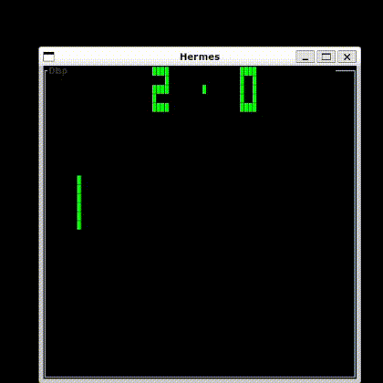

<a name="readme-top"></a>
<!-- PROJECT LOGO -->
<br />
<div align="center">

  <h3 align="center">HERMES</h3>

  <p align="center">
    An awesome gamesystem emulator emulatting chip8!
    <br />
    <a href="#demo">View Demo</a>
    ·
    <a href="https://github.com/crypto-0/hermes/issues">Report Bug</a>
    ·
    <a href="https://github.com/crypto-0/hermes/pulls">Request Feature</a>
  </p>
</div>


<!-- TABLE OF CONTENTS -->
<details>
  <summary>Table of Contents</summary>
  <ol>
    <li>
      <a href="#about-the-project">About The Project</a>
    </li>
    <li>
      <a href="#getting-started">Getting Started</a>
      <ul>
        <li><a href="#prerequisites">Prerequisites</a></li>
        <li><a href="#installation">Installation</a></li>
      </ul>
    </li>
    <li><a href="#usage">Usage</a></li>
    <li><a href="#keypad">Keypad</a></li>
    <li><a href="#demo">Demo</a></li>
    <li><a href="#license">License</a></li>
  </ol>
</details>


<!-- ABOUT THE PROJECT -->
## About The Project

This is a simple Chip 8 emulator written in java. CHIP-8 is an interpreted programming language, developed by Joseph Weisbecker. It was initially used on the COSMAC VIP and Telmac 1800 8-bit microcomputers in the mid-1970s. CHIP-8 programs are run on a CHIP-8 virtual machine. It was made to allow video games to be more easily programmed for said computers.

Here's why I took on this challenge:
* learn how a CPU can utilize memory, stack, program counters, stack pointers, memory addresses, and registers.
* lean how a CPPU implements fetch, decode, and execute.
* learn how to disassemble and decode opcode into CPU instruction that can be used
* learn how a graphic processing unit works
* learn how multiple parts of a system communicates using buses
* learn how interrupts are triggled and handled

<p align="right">(<a href="#readme-top">back to top</a>)</p>


<!-- GETTING STARTED -->
## Getting Started

### Prerequisites

* java JDK
* java JRE
* maven

### Installation
```sh
$ git clone https://github.com/crypto-0/hermes.git
$ cd hermes
$ mvn package
$ cd target 
```
<p align="right">(<a href="#readme-top">back to top</a>)</p>

<!-- USAGE EXAMPLES -->
## Usage
```sh
$ java -jar hermes-1.0-SNAPSHOT-jar-with-dependencies.jar
Usage: java -jar Hermes.jar [OPTIONS]

Options:
  --help Show this message and exit
  --rom choose a rom to run from available roms
  --debug start in debug mode
Available roms:
  Tetris
  Pong
  Brick
  Brix
  Space-Invaders
```
### --help argument
this argument is used to get help if lost or don't know what to do and will exist the emulator after

### --rom argument
this argument is used to select one of the five roms available with this emulator which are Tetris, Pong, Brick, Brix, and Space-Invaders

### --debug argument
this argument is used to start the emulator in debug mode which the emulator will show cpu information such as registers and also show ram memory that can be scrolled.

<p align="right">(<a href="#readme-top">back to top</a>)</p>

## Keypad
The original Chip 8 had a hexadecimal keypad (0 - 9 and A - F). The key mapping here is as follows -

| Chip 8 Key | Keyboard Key |
| :--------: | :----------: |
| `1`        | `1`          |
| `2`        | `2`          |
| `3`        | `3`          |
| `4`        | `Q`          |
| `5`        | `W`          |
| `6`        | `E`          |
| `7`        | `A`          |
| `8`        | `S`          |
| `9`        | `D`          |
| `0`        | `X`          |
| `A`        | `Z`          |
| `B`        | `C`          |
| `C`        | `4`          |
| `D`        | `R`          |
| `E`        | `F`          |
| `F`        | `V`          |

<p align="right">(<a href="#readme-top">back to top</a>)</p>

## Demo

<p align="right">(<a href="#readme-top">back to top</a>)</p>

<!-- LICENSE -->
## License

Distributed under the MIT License.

<p align="right">(<a href="#readme-top">back to top</a>)</p>


